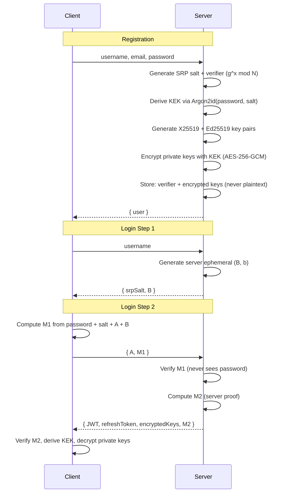
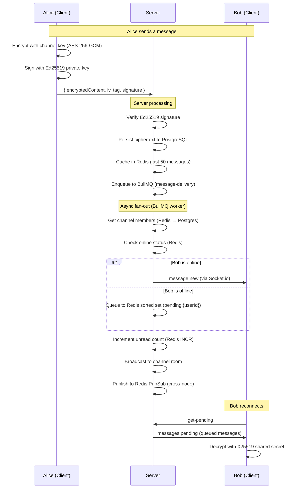
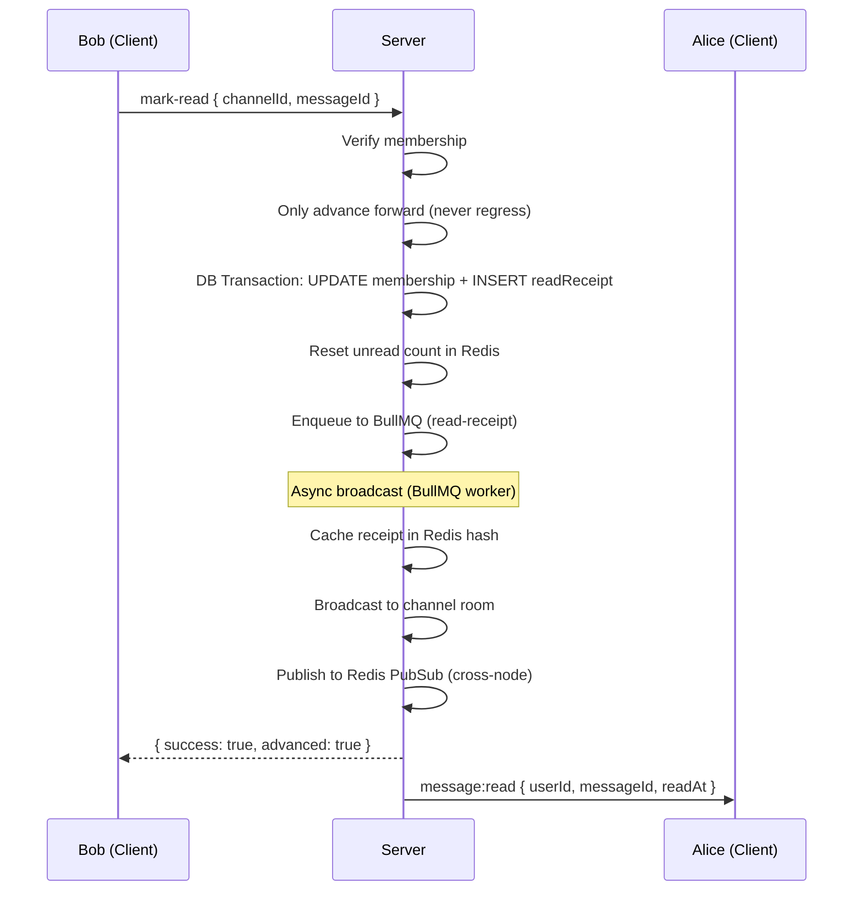
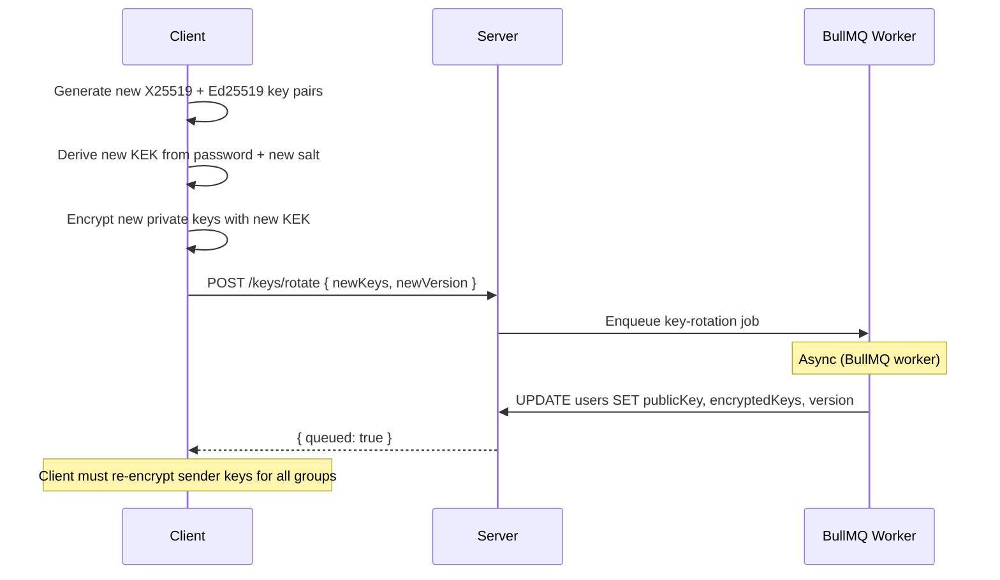
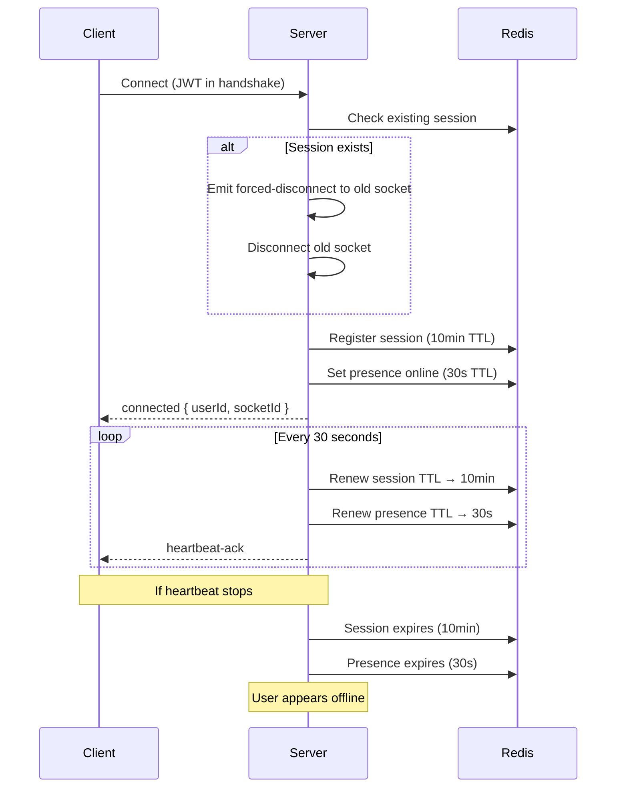
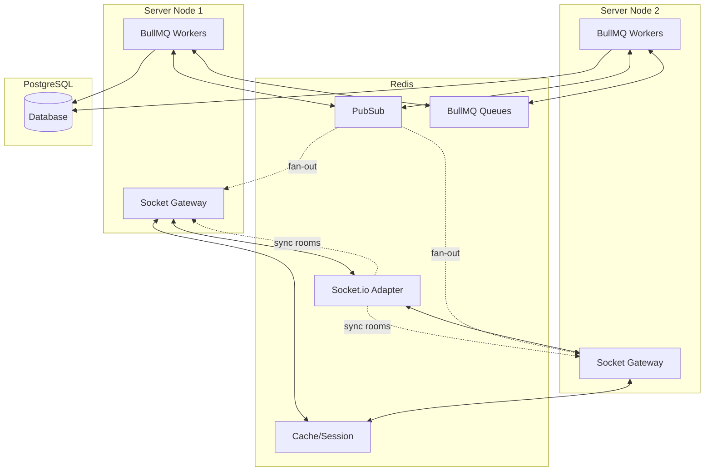
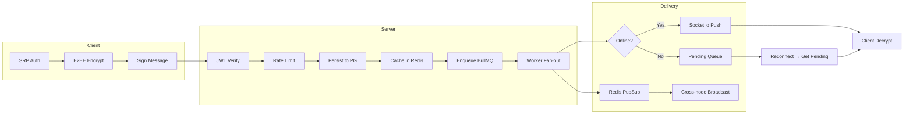

<p align="center">
  <h1 align="center">ZEVRA</h1>
  <p align="center"><b>Z</b>ero-knowledge <b>E</b>vents <b>V</b>erified <b>R</b>ealtime <b>A</b>rchitecture</p>
  <p align="center">End-to-End Encrypted Messaging Server</p>
</p>

<p align="center">
  <a href="https://github.com/BazilSuhail/ZEVRA-Server">
    
  </a>
  <a href="https://github.com/BazilSuhail/ZEVRA">
    
  </a>
</p>

<p align="center">
  
  
  
  
  
  
</p>

---

## About

ZEVRA is a secure messaging platform built on the principle that **privacy is a right, not a feature**. The server never sees your password, never reads your messages, and never stores your private keys in plaintext. If the database is stolen, attackers get only encrypted gibberish.

## Features & Functionality

### Core Capabilities

- **Zero-Knowledge Authentication** — SRP-6a protocol (RFC 5054, 2048-bit MODP group). Server verifies password without ever seeing or storing it. No password hashes, no bcrypt, no plaintext.
- **End-to-End Encryption** — All message content encrypted client-side with AES-256-GCM. Server stores only ciphertext + IV + auth tag. Zero access to plaintext.
- **Dual Key Pairs** — X25519 for key exchange (ECDH shared secrets), Ed25519 for message signing (non-repudiation). Private keys sealed with Argon2id-derived KEK.
- **Real-Time Messaging** — Socket.io WebSocket gateway with room-based channel broadcasting, typing indicators, and presence tracking.
- **Async Message Delivery** — Sync persist to PostgreSQL + cache in Redis, then async fan-out via BullMQ workers. Sender gets ACK in <50ms.
- **Offline Message Queue** — Messages for offline users queued in Redis sorted sets (scored by sequence number). Delivered on reconnect.
- **Read Receipts** — Per-message read tracking with waterhead advancement (never regresses). Broadcast to senders via BullMQ + Redis PubSub.
- **Multi-Node Support** — Socket.io Redis adapter syncs rooms across instances. Redis PubSub handles cross-node fan-out. BullMQ workers run on any node.
- **Sliding Window Rate Limiting** — Redis sorted-set based. Per-route limits: 500 msg/s, 200 typing/s, 1000 fetch/s, 2000 connections/min per IP.
- **Circuit Breaker** — 5 failures → OPEN (30s) → HALF_OPEN → CLOSED. Prevents cascading downstream failures.
- **Key Rotation** — Async via BullMQ. Client generates new keys, server updates atomically. Brief window where old keys valid (acceptable for infrequent rotation).
- **Sender Key Ratchet** — Group E2EE with epoch-based key rotation. Keys re-encrypted for each member on rotation.
- **Graceful Degradation** — All Redis-backed features fail open (allow requests, return safe defaults) when Redis is unavailable.

### Technical Stack

| Component | Technology | Purpose |
|-----------|------------|---------|
| Runtime | Bun | Fast TypeScript execution |
| Framework | NestJS 11 | Modular architecture, DI, guards, pipes |
| Database | PostgreSQL (Neon) | Persistent storage, 9 tables, 12 foreign keys |
| ORM | Drizzle ORM | Type-safe queries, migrations, schema push |
| Cache/PubSub | Redis (Redis Labs) | 8 distinct roles: sessions, presence, cache, pub/sub, rate limits, channel members, pending msgs, Socket.io adapter |
| Job Queue | BullMQ | 3 queues: message-delivery (10 workers), read-receipt (5 workers), key-rotation (1 worker) |
| Realtime | Socket.io v4 | WebSocket gateway with Redis adapter for multi-node |
| Auth | SRP-6a + JWT | Zero-knowledge password proof + 15min access tokens + 7d refresh tokens |
| Crypto | Argon2id + X25519 + Ed25519 + AES-256-GCM | KDF, key exchange, signing, authenticated encryption |
| Security | Helmet + Rate Limiter + Circuit Breaker | HTTP headers, sliding window limits, failure isolation |

### Workflow Diagrams

#### Zero-Knowledge Authentication (SRP-6a)



#### End-to-End Encrypted Messaging



#### Read Receipts



#### Key Rotation



#### Single-Device Session with Heartbeat



#### Multi-Node Architecture



#### System Overview



## Quick Start

```bash
# Install
bun install

# Configure
cp .env.example .env   # Add your Neon + Redis credentials

# Push schema
bunx drizzle-kit push

# Run
bun run start:dev
```

Server runs at `http://localhost:3000`.

## Documentation

| Document | Description |
|----------|-------------|
| [Architecture](docs/architecture.md) | System overview, module map, request lifecycle, design tradeoffs |
| [Database](docs/database.md) | Schema reference, 9 tables, relationships, migrations |
| [REST API](docs/api-rest.md) | All HTTP endpoints, request/response formats, rate limits |
| [WebSocket API](docs/api-websocket.md) | Socket.io events, connection lifecycle, all client/server events |
| [Redis](docs/redis.md) | 8 Redis roles, key patterns, TTLs, data structures |
| [BullMQ](docs/bullmq.md) | 3 job queues, worker flows, retry config |
| [E2EE](docs/e2ee.md) | SRP-6a auth, key management, sender keys, encryption flow |
| [Security](docs/security.md) | Rate limiting, circuit breaker, Helmet, JWT lifecycle |
| [Deployment](docs/deployment.md) | Setup, env vars, Neon/Redis config, production build |

## Security Guarantees

| Threat | Protection |
|--------|------------|
| Database breach | All private data encrypted; SRP verifier cannot reverse to password |
| MITM | E2EE + key verification |
| Stolen device | Password protects KEK; remote revocation via key rotation |
| Insider threat | Employees see only ciphertext and metadata |
| Forward secrecy | Sender keys ratchet per epoch |
| Replay attacks | Sequence numbers per channel |
| Sender forgery | Ed25519 signatures on every message |
| Credential stuffing | SRP (no password hash stored) |

## License

MIT
